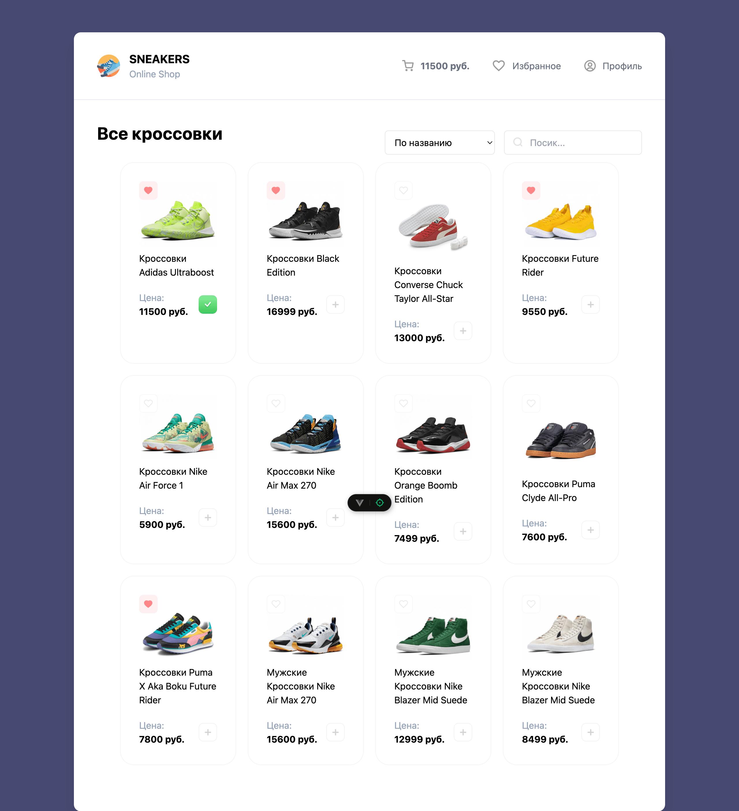

# Интернет-магазин Кроссовок

[Ссылка на деплой на Vercel](https://sneakers-crw5my150-yaroslavs-projects-c6eb330e.vercel.app/)



## Описание и функциональность

Интернет-магазин кроссовок на Vue.js.

Функционал:

- Добавление / удаление товаров в корзину и в избранное;
- Поиск товаров по фильтрам.

Технологии:

- Vue 3;
- Vue Router;
- TailwindCSS;
- Axios;
- @formkit/auto-animate;
- Composition API / Options API;
- ESLint;
- Prettier.

Планы:

- Разработать функцинал Профиля.

## Инструкция по установке

```
npm install
npm start
```

[Документация к тестовому API Mokky](https://mokky.gitbook.io/welcome)
